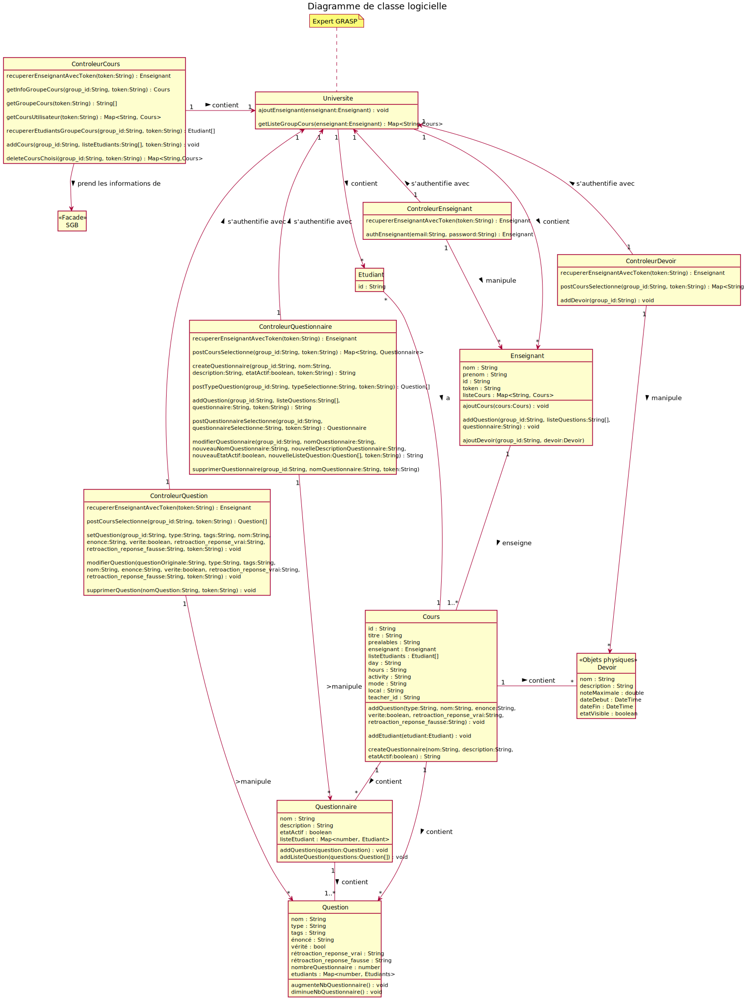

<!-- Changer le numéro de l'itération plus bas pour chaque rapport -->
# Rapport Itération numéro i

## Identification des membres de l'équipe

Assurez-vous d'utiliser toujours le même compte GitHub pour accéder à ce projet.

## Membre 1

- <nomComplet1>Anna Andersen</nomComplet1>
- <courriel1>anna.andersen.1@ens.etsmtl.ca</courriel1>
- <codeMoodle1>AQ80740</codeMoodle1>
- <githubAccount1>aandersen-mal</githubAccount1>

## Membre 2

- <nomComplet2>Thomas Beetz</nomComplet2>
- <courriel2>Thomas.beetz.1@ens.etsmtl.ca</courriel2>
- <codeMoodle2>AP59120</codeMoodle2>
- <githubAccount2>Thomas-Beetz-Knowledge</githubAccount2>

## Membre 3

- <nomComplet3>Nick-Karl Chao</nomComplet3>
- <courriel3>nick-karl.chao.1@ens.etsmtl.ca</courriel3>
- <codeMoodle3>AQ18340</codeMoodle3>
- <githubAccount3>n3chao</githubAccount3>

## Membre 4

- <nomComplet4>Lucas Schwing</nomComplet4>
- <courriel4>lucas.schwing.1@ens.etsmtl.ca</courriel4>
- <codeMoodle4>AR77560</codeMoodle4>
- <githubAccount4>Lukip2603</githubAccount4>

## Membre 5

- <nomComplet5>Shi Yao Wang</nomComplet5>
- <courriel5>shi-yao.wang.1@ens.etsmtl.ca</courriel5>
- <codeMoodle5>AQ87340</codeMoodle5>
- <githubAccount5>syw1-art</githubAccount5>

<!-- Enlever les sections membres non utilisées -->

## Exigences

> Liste des exigences et personnes responsables de celles-ci.

| Exigence | Responsable                                |
| -------- | ------------------------------------------ |
| CU01a    | Anna Andersen, Lucas Schwing               |
| CU01b    | Nick-Karl Chao, Shi Yao Wang               |
| CU02a    | Anna Andersen, Lucas Schwing, Thomas Beetz |

## Modèle du domaine (MDD)

## Diagramme de séquence système (DSS)

> Un seul DSS sera choisi et corrigé par l'auxiliaire d'enseignement

>>CU01a

>>CU01b

>>CU02a

## Contrats

> Si vous avez choisi un cas d'utilisation nécessitant un contrat, il faut le mettre dans cette section.
> Note: même s'il y a plusieurs contrats, un seul contrat sera choisi et corrigé par l'auxiliaire d'enseignement

>>CU01a

### Opération getGroupeCours(enseignant : Enseignant)
Postconditions:
- Aucune

### Opération postGroupeCoursChoisi(groupeCoursChoisi : String)
Postconditions:
- Aucune

### Opération: setCours(groupeCoursChoisi)

Postconditions:
- une nouvelle instance c de Cours a été créée
- c a été associée a l'enseignant enseignant
- c a été associé aux groupes d'étudiants inscrits etudiant[]

>>CU01b

### getListeNomsCours()
Postconditions:
- Aucune

### getInformationsCours(nomCours : String)
Postconditions:
- Aucune

### getListeNomsEtudiantsCours(nomCours : String)
Postconditions:
- Aucune

>>CU02a

### Opération getListCoursActif(enseignant : Enseignant)
Postconditions:
- Aucune

### Opération postCoursSelectionne(coursSelectionne : String)
Post conditions:
- Aucune

### Opération: setQuestion(type : String, tags : String, nom : String,énoncé : String, vérité : bool,rétroaction_reponse_vrai, rétroaction_reponse_fausse)

Postconditions:
- une nouvelle instance q de Question a été créée
- q a été associée au cours

## Réalisation de cas d'utilisation (RDCU)

> Chaque cas d'utilisation nécessite une RDCU.
> Note: une seule RDCU sera choisie et corrigée par l'auxiliaire d'enseignement

>>CU01a

>>CU01b

>>CU02a

## Diagramme de classe logicielle (DCL)

> Facultatif, mais fortement suggéré
> Ce diagramme vous aidera à planifier l'ordre d'implémentation des classes.  Très utile lorsqu'on utilise TDD.

## Vérification finale

- [x] Vous avez un seul MDD
  - [x] Vous avez mis un verbe à chaque association
  - [x] Chaque association a une multiplicité
- [x] Vous avez un DSS par cas d'utilisation
  - [x] Chaque DSS a un titre
  - [x] Chaque opération synchrone a un retour d'opération
  - [x] L'utilisation d'une boucle (LOOP) est justifiée par les exigences
- [x] Vous avez autant de contrats que d'opérations système (pour les cas d'utilisation nécessitant des contrats)
  - [x] Les postconditions des contrats sont écrites au passé
- [x] Vous avez autant de RDCU que d'opérations système
  - [x] Chaque décision de conception (affectation de responsabilité) est identifiée et surtout **justifiée** (par un GRASP ou autre heuristique)
  - [ ] Votre code source (implémentation) est cohérent avec la RDCU (ce n'est pas juste un diagramme)
- [x] Vous avez un seul diagramme de classes
- [x] Vous avez remis la version PDF de ce document dans votre répertoire
- [x] [Vous avez regardé cette petite présentation pour l'architecture en couche et avez appliqué ces concepts](https://log210-cfuhrman.github.io/log210-valider-architecture-couches/#/)

